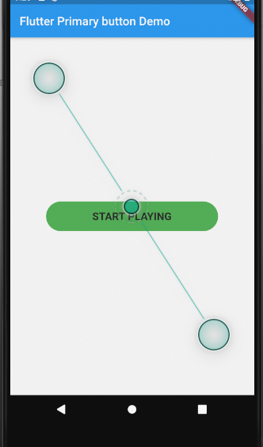

# flutter_primary_button

A new Flutter package help developer to use stylish and simple primary buttons


## Installation

Add the following to pubspec.yaml
```yaml
dependencies:
...
primary_btn: ^0.0.1
```

## Usage Example

import nice_button.dart
```dart
import 'package:primary_btn/PrimaryButton.dart';
```

### For normal buttons

```dart
  PrimaryButton(
                        onPressed:() => print("tapped"),
                        fontSize:18,
                        textColor: Color(0xff212121),
                        bgColor:Colors.green,
                        width:290,
                        height:50,
                        buttonLabel: "START PLAYING",
                      ),
```
#### screenshot example
 

**Refer to [git repo ](https://github.com/arorapuneet29/flutter_primary_btn) and the source code for more information.**

