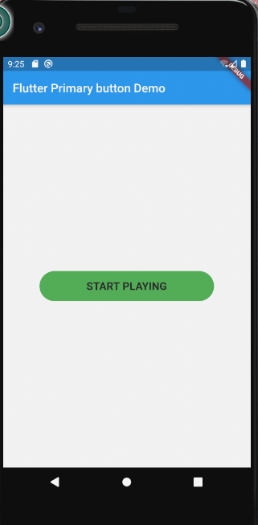

# flutter_primary_button

A new Flutter package help developer to use stylish and simple primary buttons

## Installation

Add the following to pubspec.yaml

```yaml
dependencies:
---
primary_button: ^0.0.1
```

## Usage Example

import primary_button.dart

```dart
import 'package:primary_button/PrimaryButton.dart';
```

### For normal buttons

```dart
  PrimaryButton(
                onPressed:() => print("tapped"),
                fontSize:18,
                textColor: Color(0xff212121),
                bgColor:Colors.green,
                width:290,
                height:50,
                buttonLabel: "START PLAYING",
                ),
```

#### Screenshot example



**Refer to [Git repo link ](https://github.com/arorapuneet29/flutter_primary_button) and the source code for more information.**
